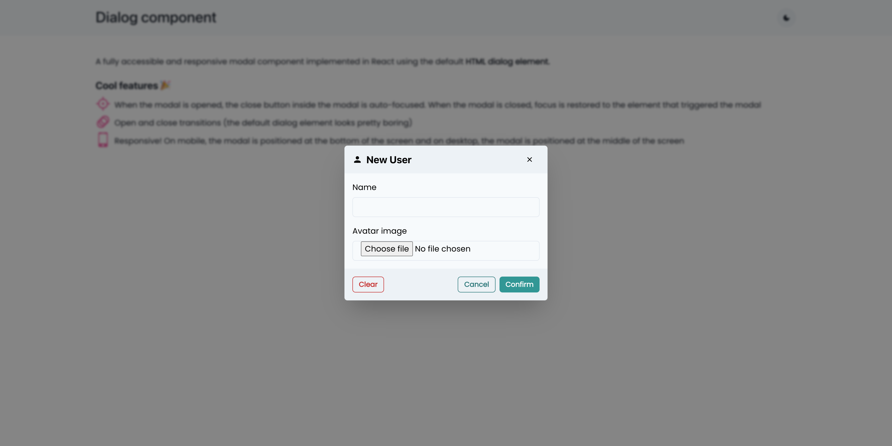
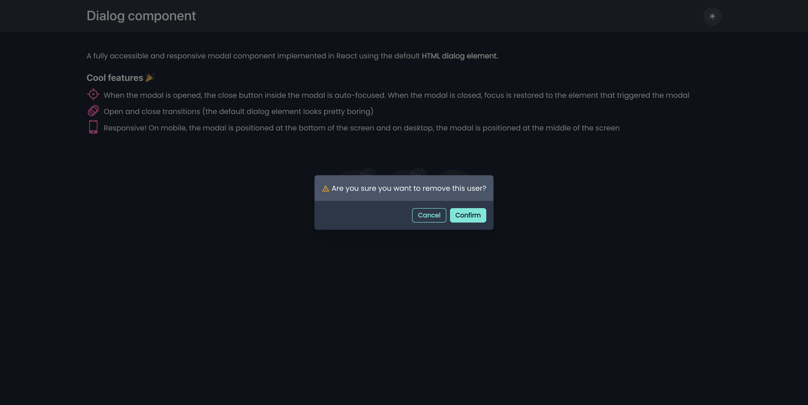
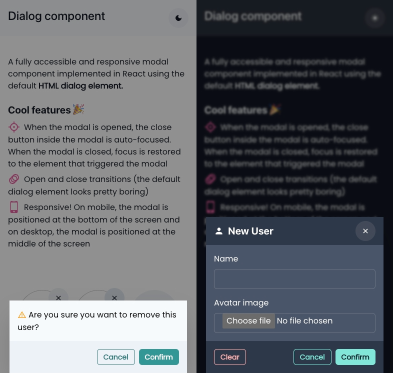

# Modal component

A fully accessible and responsive modal component implemented in React using the default [HTML dialog element](https://developer.mozilla.org/en-US/docs/Web/HTML/Element/dialog).

## Cool features 🎉

-   When the modal is opened, the close button inside the modal is auto-focused. When the modal is closed, focus is restored to the element that triggered the modal.
-   Open and close transitions (the default dialog element looks pretty boring).
-   Responsive! On mobile, the modal is positioned at the bottom of the screen and on desktop, the modal is positioned at the middle of the screen.

### Dialog in light mode

### Confirmation dialog in dark mode

### Mobile

